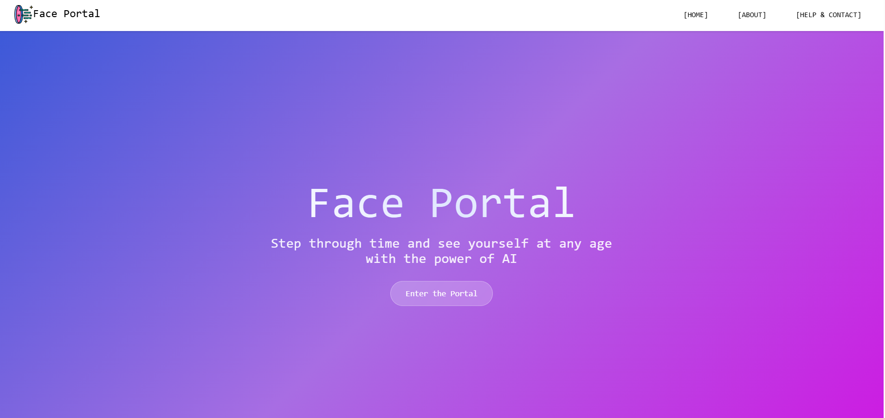
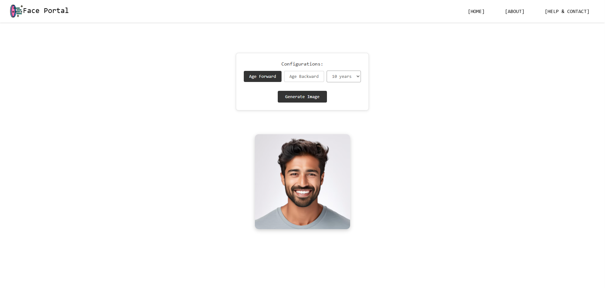
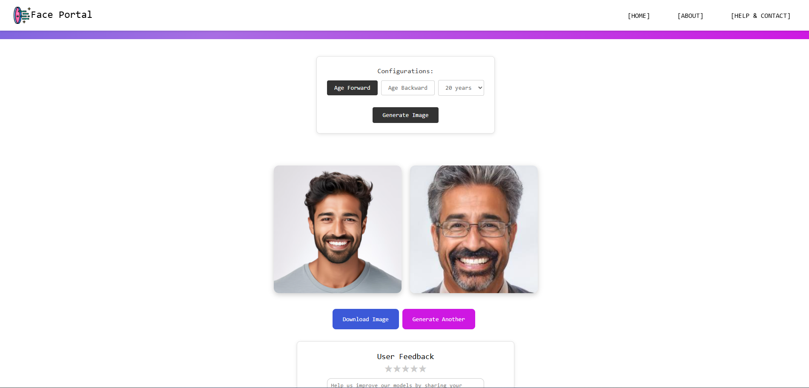
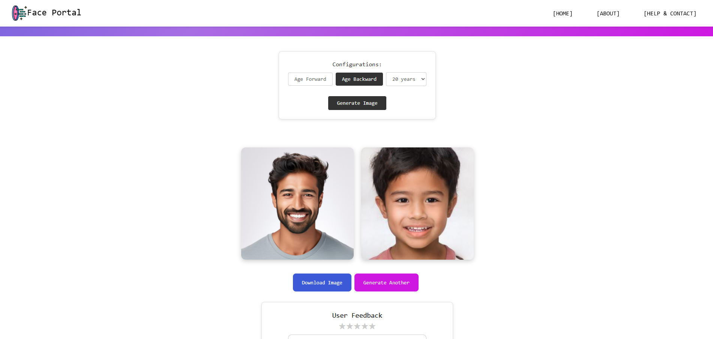

# Face Portal

**Face Portal** is a web-based image generation demo built using Generative Adversarial Neural Networks**. Upload an image of yourself, and the model will generate an aged version of you!

Built by Marvin Guerrero-Rangel.

##  Purpose

This project was created to learn React and dive deeper into AI/DL. The goal is to build a robust system ready for real users.

##  Features

- Upload an image of yourself directly from your device
- Clean responsive design
- Dynamically rendered pages
- User Feedback form
- Comprehensive About page

##  Tech Stack

- **Frontend:** React + Vite
- **Deployment:** Vercel
  

